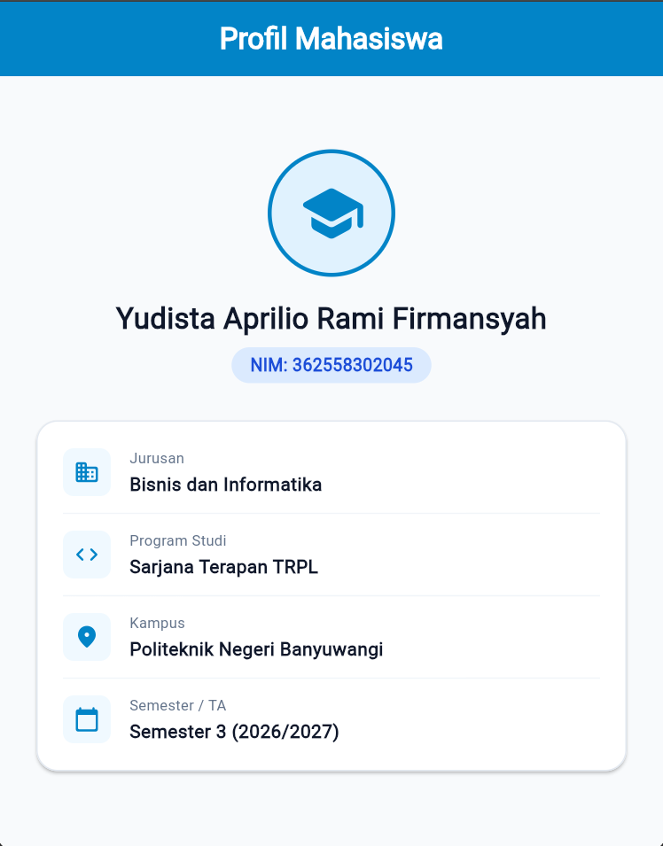
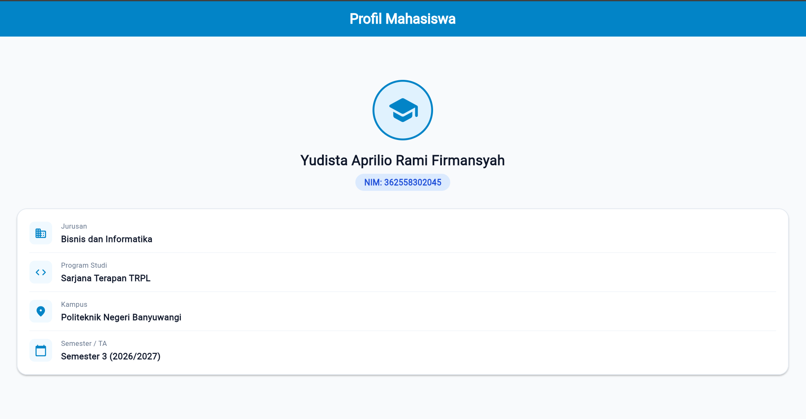

# Laporan Praktikum Modul 01: Mobile Ecosystem, Flutter Setup & Profile App

- **Nama**: Yudista Aprilio Rami Firmansyah
- **NIM**: 362558302045
- **Kelas / Prodi**: 2C/ Sarjana Terapan TRPL
- **Mata Kuliah**: Pemrograman Perangkat Bergerak (Semester 3)

---

## 1. Ringkasan Aktivitas
Pada pembelajaran mata kuliah Pemrograman Perangkat Bergerak minggu 1 ini, saya melakukan instalasi dan konfigurasi Flutter sebagai langkah awal untuk mempelajari aplikasi perangkat bergerak. Flutter digunakan sebagai framework untuk membuat aplikasi dengan bahasa pemrograman Dart.

Setelah saya berhasil menginstall Flutter, kemudian saya mencoba membuat dan menjalankan project sederhana yaitu membuat aplikasi tampilan frofil mahasiswa. Saya juga melakukan pengujian tampilan aplikasi dalam mode portrait dan landscape, kemudian mengambil screenshot sebagai dokumentasi hasil pembelajaran pada minggu ini.

## 2. Bukti Tangkapan Layar (Running App)
| Mode Portrait | Mode Landscape |
|---|---|
|  |  |

## 3. Kendala yang Dihadapi & Solusinya
- **Kendala**: Saat saya melakukan pengecekan instalasi Flutter menggunakan perintah flutter --version dan flutter doctor melalui CMD, ternyata Flutter belum dapat dikenali dengan baik. Setelah diperiksa, kendala tersebut disebabkan oleh konfigurasi Environment Variable (PATH) yang belum sesuai.
- **Solusi**: Saya mengatasi masalah tersebut dengan membuka pengaturan Environment Variables pada Windows, kemudian mengatur posisi path Flutter di urutan paling atas. Setelah konfigurasi diperbaiki, saya melakukan pengecekan kembali dengan perintah yang sama seperti tadi hingga Flutter dapat dikenali dan bisa dijalankan.

## 4. Jawaban Pertanyaan Refleksi
1. **Pilihan Native vs Flutter**: Saya memilih Flutter karena bisa membuat aplikasi untuk beberapa platform dengan satu kode. Selain itu, Dart juga cukup mudah dipelajari dan Flutter punya banyak widget untuk membuat UI.
2. **Prinsip UI = f(state)**: Tampilan aplikasi mengikuti kondisi atau data yang ada. Kalau datanya berubah, tampilan UI juga akan ikut berubah.
3. **Pentingnya Conventional Commits**: Conventional Commits membuat pesan commit lebih rapi dan mudah dipahami. Jadi, anggota kelompok bisa lebih gampang mengetahui perubahan yang dilakukan di project GitHub.